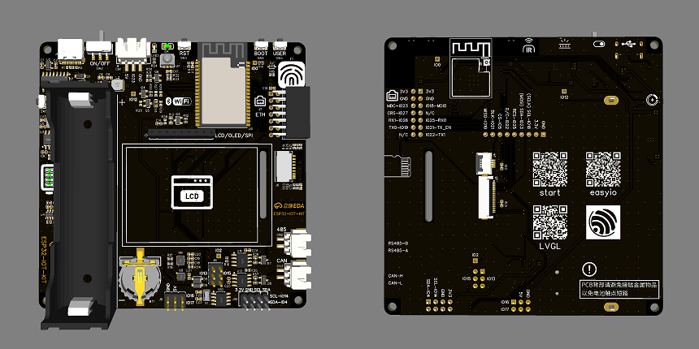

<!-- _coverpage.md -->

# Easyio & ESP-IOT-KIT <small>3.5</small>

> 一个适配ESP-IDF的ESP32驱动库。

- 驱动齐全、例程丰富（Demo目前有将近60个）
- 即拖即用，不需修改配置文件。
- 众多例程，畅玩IOT。GPIO、KEY、PWM、RMT、ADC、DAC、UART、485、I2C、SPI、LCD、SmartConfig配网、Blufi配网、ETH有线以太网、LVGL-GUI。
- 板载电池，脱机可用。
- 持续更新，欢迎反馈。

[GitHub](https://github.com/ZhiliangMa/easyio-lib-for-esp32)
[Get Started](https://blog.csdn.net/Mark_md/article/details/120132945?spm=1001.2014.3001.5501)