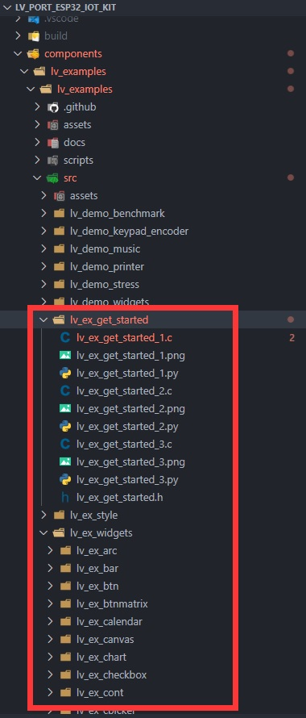
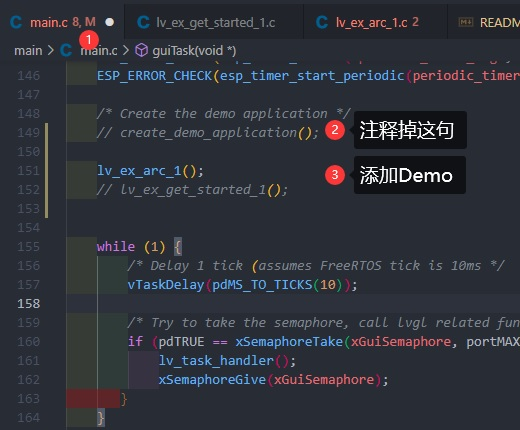
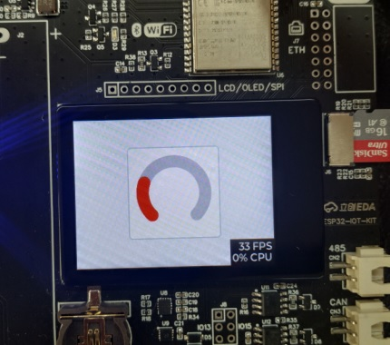

# LVGL_V7

This is an ESP32 demo project showcasing LVGL v7 with support for several display controllers and touch controllers.

此工程fork自 [lvgl/lv_port_esp32](https://github.com/lvgl/lv_port_esp32)

修改了 `sdkconfig`，以适配`ESP32-IOT-KIT`开发板的 `ST7789V + FT6236U` 单点电容屏。

- Version of ESP-IDF required 4.2. 

- Version of LVGL used: 7.9.

***

## 如何使用

1. 递归clone本代码：
```
git clone --recurse-submodules https://github.com/ZhiliangMa/lv_port_esp32_iot_kit.git
```

2. 确保电脑已有 `ESP-IDF V4.2` 环境，`cd` 移动到工程目录。

3. 编译
```
idf.py build
```

4. 下载烧录
```
idf.py flash
```

即可在液晶屏上看到下图显示。

电容触摸屏可用，可进行拖拽、滑动操作，开发板配套的`FT6236U` 为单点电容屏。


<br/>

同时开发板允许使用上方的 `J5`接口，去插接额外的LCD模组。


<br/>

运行正视图。


***

## Demo演示和帧率

此工程可通过图形化设置项，去运行的有4个Demo。

`Component config` >> `lv_examples configuration` >> `Select the demo you want to run`

分别为：
- Show demo widgets。控件演示，使能`Set IRAM as LV_ATTRIBUTE_FAST_MEM`后，320x240分辨率，帧率约为20FPS。

- Demonstrate the usage of encoder and keyboard。可以很好的演示触摸屏和一些拖拽控件，无动作时满帧，有拖动动作时不算特别流畅。

- Benchmark your system。跑分，测试系统刷图成绩。

- Stress test for LVGL。压力测试，帧率抖动明显。


除这4个意外，还可手动改动代码，将 `lv_port_esp32_iot_kit\components\lv_examples\lv_examples\src` 目录下的 `lv_demo_music`、`lv_demo_printer`、`lv_ex_get_started`、`lv_ex_style`、`lv_ex_widgets` 导入运行。


***

## 更多控件的Demo

- 更多例程可见 `components/lv_examples` 目录下的 `lv_ex_get_started`、`lv_ex_style`、`lv_ex_widgets` 文件夹内的 Demo。

- 其中，`lv_ex_widgets` 为所有控件的例程，可帮助我们学习。

- 支持文档：[官方在线文档 - Demo及预览](https://docs.lvgl.io/master/examples.html#a-button-with-a-label-and-react-on-click-event)



### 如何使用单独控件的Demo

- 1、在main中，引用头文件。

```c
#include "lv_examples/lv_examples.h"
```

- 2、在`main.c`中，注释掉原有的 `create_demo_application();`，添加对应的控件Demo。如 `components/lv_examples/lv_ex_widgets/lv_ex_arc` 中的 弧形控件。



- 3、编译、下载运行。能看到如下运行现象。



- 4、LVGL官方附带的Demo，都是跟上面一样的使用方法。支持文档：[官方在线文档 - Demo及预览](https://docs.lvgl.io/master/examples.html#a-button-with-a-label-and-react-on-click-event)


***

## 配套Visual Studio模拟器

&emsp;&emsp;因ESP32的编译、下载速度较慢，且需要电脑连接ESP32设备，导致调试过程些许繁琐。这时可用LVGL的模拟器，来模拟设备开发，运行现象基本一致，代码复制到设备上几乎不用做额外的修改，可加快LVGL界面的开发进程。

- 因本工程的LVGL版本为V7.9，故模拟器也应该使用V7版本的。递归clone，VS模拟器的v7版本分支：
```
git clone --recurse-submodules -b release/v7 https://github.com/lvgl/lv_sim_visual_studio.git
```

&emsp;&emsp;不过我运行时，此分支不能正常运行，只有master可正常运行，即V8的模拟器可正常运行。

***